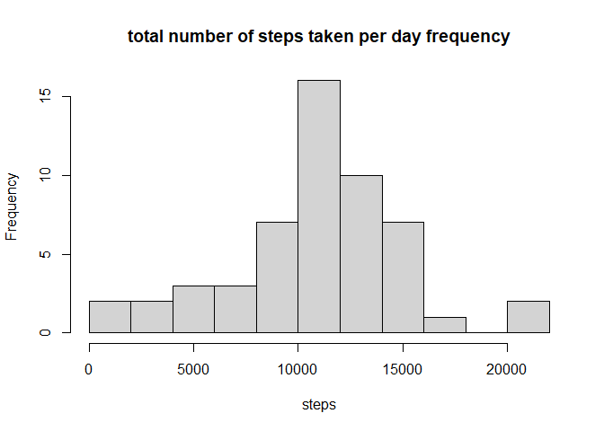
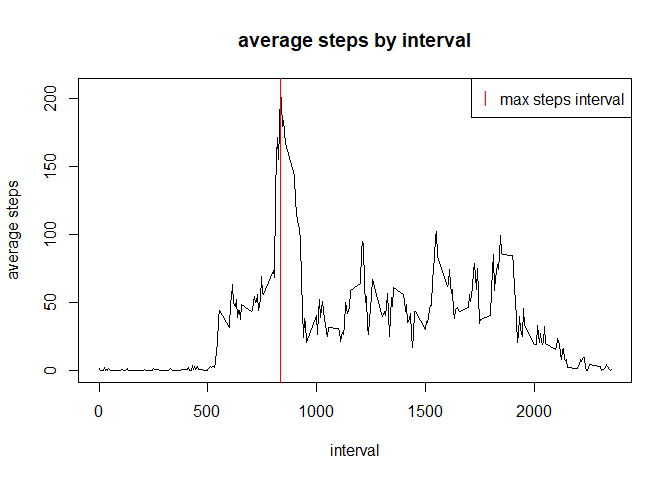
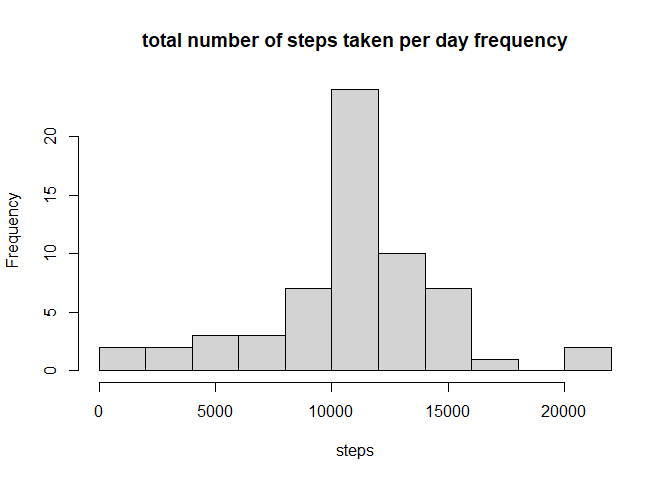
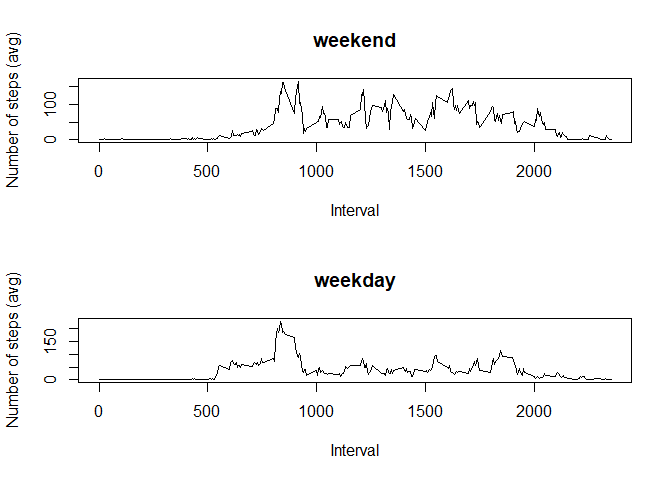

## Loading and preprocessing the data

```r
# the script is on the same directory as the zip file, the file name is enough
zipfile <- "activity.zip"
unzip(zipfile = zipfile, exdir = "data")
activity <- read.csv("data/activity.csv")
activity$date <- as.Date(activity$date)
knitr::opts_chunk$set(fig.path='figure/')
```

## What is mean total number of steps taken per day?

```r
# for this task I will remove missing data (record with NAs in steps variable)
activityClean <- activity[!is.na(activity$steps),]
activityByDate <- tapply(activityClean$steps, activityClean$date, sum)
days <- unique(activityClean$date)
# plot the histogram. I override the breaks parameter default
hist(activityByDate, xlab = "steps", 
     main = "total number of steps taken per day frequency", breaks = 10)
```

<!-- -->

```r
# just take the integer (as displayed by summary)
mean <- as.integer(mean(activityByDate))
median <- as.integer(median(activityByDate))

# ugly but I cannot use inlining because the code will not be shown
print(paste("The average number of steps is ", mean))  
```

```
## [1] "The average number of steps is  10766"
```

```r
print(paste("The median of the total number of steps taken per day is", median))
```

```
## [1] "The median of the total number of steps taken per day is 10765"
```

## What is the average daily activity pattern?

```r
activityByInterval <- tapply(activityClean$steps, activityClean$interval, mean)
intervals <- unique(activityClean$interval)
plot(x=intervals, y=activityByInterval, type = "l", xlab = "interval",
     ylab="average steps", main="average steps by interval")

maxStepsInterval <- intervals[which.max(activityByInterval)]

abline(v = maxStepsInterval, col = "red")

legend(x = "topright", col=c("red"), pch="|", legend=c("max steps interval"))
```

<!-- -->

```r
print(paste("the 5' interval with most steps on average is ", maxStepsInterval))
```

```
## [1] "the 5' interval with most steps on average is  835"
```

```r
print(paste("the max number of steps in average is ", max(activityByInterval)))
```

```
## [1] "the max number of steps in average is  206.169811320755"
```

## Imputing missing values

```r
NAs <- is.na(activity$steps)
NAsNum <- sum(NAs)
print(paste("in the original dataset there are ", NAsNum, " missing values"))
```

```
## [1] "in the original dataset there are  2304  missing values"
```

```r
# as suggested in the assignment I will replace NAs with the average value in
#     that interval. Since the activity by interval are the same for each day
#     I will replicate it for as many times as the days to be considered. This
#     will simplify the filling of missing values
period <- rep(activityByInterval, times=length(unique(activity$date)))
activityCompleted <- activity
activityCompleted$steps[NAs] <- period[NAs]

activityCompletedByDay <- tapply(activityCompleted$steps, activityCompleted$date, sum)

# plot the histogram. I override the breaks parameter default
hist(activityCompletedByDay, xlab = "steps", 
     main = "total number of steps taken per day frequency", breaks = 10)
```

<!-- -->

```r
# just take the integer (as displayed by summary)
meanCompleted <- as.integer(mean(activityCompletedByDay))
medianCompleted <- as.integer(median(activityCompletedByDay))

# ugly but I cannot use inlining because the code will not be shown
print(paste("The average number of steps is ", meanCompleted))  
```

```
## [1] "The average number of steps is  10766"
```

```r
print(paste("The median of the total number of steps taken per day is", medianCompleted))
```

```
## [1] "The median of the total number of steps taken per day is 10766"
```
From the histogram and the average and median calculated we can conclude that
completing the missing data using averages by interval does not greatly change
the estimates.


## Are there differences in activity patterns between weekdays and weekends?

```r
# my system speaks Italian... to make it more international I force English
Sys.setlocale("LC_ALL","English")
```

```
## [1] "LC_COLLATE=English_United States.1252;LC_CTYPE=English_United States.1252;LC_MONETARY=English_United States.1252;LC_NUMERIC=C;LC_TIME=English_United States.1252"
```

```r
wd <- weekdays(activityCompleted$date)
activityCompleted$type <- "weekday"
activityCompleted$type[wd == "Saturday" | wd == "Sunday"] <- "weekend"
activityCompleted$type <- as.factor(activityCompleted$type)
# now I can just sum by type of day (weekend or weekday) and interval
averagesByIntervalAndType <- tapply(activityCompleted$steps,
                                    list(activityCompleted$type, 
                                         activityCompleted$interval), mean)

#setup a multipanel plot
par(mfrow=c(2,1))
plot(x=intervals, y=averagesByIntervalAndType["weekend",], type="l", 
     main = "weekend", ylab="Number of steps (avg)", xlab = "Interval")
plot(x=intervals, y=averagesByIntervalAndType["weekday",], type="l", 
     main = "weekday", ylab="Number of steps (avg)", xlab = "Interval")
```

<!-- -->
  
from the plot we see that the peack activity moment is similar on weekend and 
weekday.  
Weekend seems to be more relaxed

